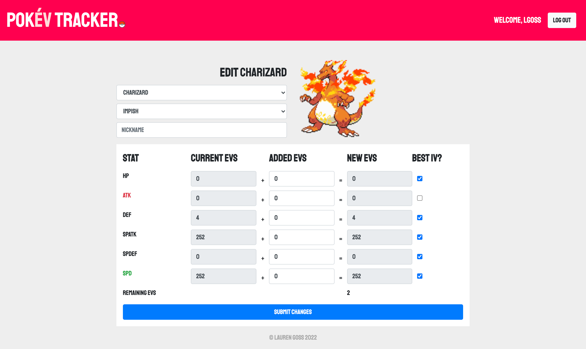

# pokemon-tracker

## Description

MERN stack application that allows the user to easily track their Pokémons' Effort Values while training.

## Table of Contents

- [Installation](#Installation)
- [Usage](#Usage)
- [Screenshots](#Screenshots)
- [Questions](#Questions)

## Installation

Required packages:

- `Node.js`
- Client:
  - `@apollo/client`
  - `@apollo/react-hooks`
  - `graphql.js`
  - `jwt-decode`
- Server:
  - `apollo-server-express`
  - `bcrypt`
  - `Express.js`
  - `graphql.js`
  - `jsonwebtoken.js`
  - `mongoose.js`

The user must run `npm i` in the root folder to install dependencies.

If in development mode, use the command `npm run develop` to start the servers. If accessing through the user's local device, the application can be found at `http://localhost:3000/`.

## Usage

This application allows a user to create an account or log in with an existing account. Upon logging in, the user can build their Pokémon team and keep track of their team's data, including:

* Species (including forms - Gigantamax, Mega, etc.)
* Nickname
* Nature
* EVs
* IVs

The deployed application can be found [here](https://pokev-tracker.herokuapp.com/).

## Screenshots

### Home

### Pokémon

### Edit Pokémon

## Questions

Do you have questions? Contact me here:

- [GitHub](https://github.com/laurenlgoss)
- [Email](laurenlgoss98@gmail.com)
